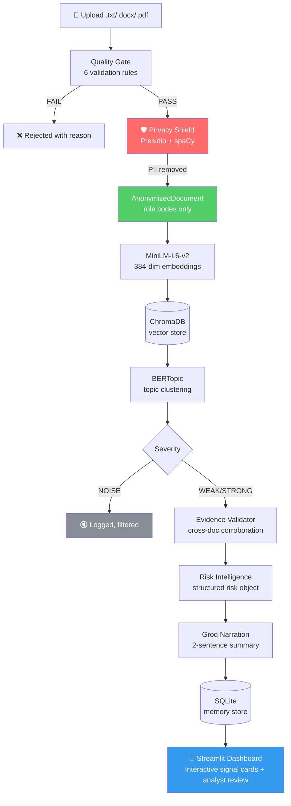

# SignalNoise AI 📡

<div align="center">

[](https://www.python.org/downloads/)
[](LICENSE)
[](https://github.com/Jagadeesh0463/signalnoise-ai/actions/workflows/ci.yml)
[](https://github.com/Jagadeesh0463/signalnoise-ai/actions/workflows/codeql.yml)
[](https://github.com/psf/black)
[](https://mypy-lang.org/)
[](CHANGELOG.md)

**Enterprise organizational intelligence platform that identifies emerging operational, delivery, and organizational risks from unstructured documents before they escalate into business-critical issues.**

[Quick Start](#quick-start) · [Architecture](#architecture) · [Documentation](docs/) · [Contributing](.github/CONTRIBUTING.md) · [Changelog](CHANGELOG.md)

> **Repository description for GitHub:** Enterprise AI platform for detecting early operational risks from organizational documents using NLP, BERTopic, vector search, and LLMs.

</div>

---

## Why SignalNoise AI?

Program managers review dozens of documents each week — sprint reviews, incident logs, support tickets, status reports. The patterns that predict delivery failures, team burnout, and operational incidents are buried in this text. No one has time to read everything and connect the dots.

SignalNoise AI analyzes organizational documents such as meeting notes, support tickets, incident reports, and status updates to identify weak signals before they evolve into major business risks.

**Privacy-first by design.** PII is stripped before any model or API call. No individual is monitored — all signals are at team and program level.

---

## Features

| Feature | Description |
|---------|-------------|
| 🛡️ **Privacy Shield** | Presidio + spaCy removes all PII before any downstream call |
| 🔍 **Semantic Detection** | BERTopic clusters MiniLM embeddings to find emergent patterns |
| 📑 **Evidence Corroboration** | Signals promoted only when confirmed across multiple documents |
| ⚡ **Risk Intelligence** | Structured risk objects with priority, owner, and suggested action |
| 🤖 **LLM Narration** | Groq writes a 2-sentence executive summary from structured data only |
| 👍 **Feedback Loop** | Confirm/Dismiss on every signal card closes the learning loop |
| 📋 **Audit Trail** | Every action logged to SQLite for compliance |
| 📊 **Analytics Dashboard** | Interactive signal cards, confidence scores, charts, CSV export, and analyst review actions |
| 🐳 **Docker Ready** | Multi-stage Dockerfile with health check, non-root user |
| 🔁 **Offline Capable** | Replace Groq with Ollama for fully on-premise deployment |

---

## Architecture



**Key invariant:** PII is removed at the Privacy Shield (red). Everything downstream — embeddings, BERTopic, Groq, SQLite, the dashboard — works exclusively on anonymized text with role codes.

---

## Technology Stack

| Layer | Technology | Why |
|-------|-----------|-----|
| Language | Python 3.10+ | Type hints, dataclasses, match statements |
| Privacy | Presidio + spaCy `en_core_web_sm` | Best-in-class PII detection, runs offline |
| Embeddings | MiniLM-L6-v2 (384-dim) | Fast on CPU, strong semantic quality, offline |
| Vector Store | ChromaDB | Self-hosted, persistent, Python-native |
| Topic Detection | BERTopic + HDBSCAN | Finds emergent patterns without labelled data |
| Memory | SQLite | Zero-config, sufficient for single-user MVP |
| LLM Risk Narration | Groq `llama3-8b-8192` (or Ollama) | Groq for demo; swap to Ollama for on-premise data sovereignty |
| Dashboard | Streamlit | Rapid iteration, Python-native |
| Knowledge Graph | NetworkX | In-process graph for signal relationships |
| Testing | pytest + pytest-cov | Standard, well-supported |
| CI | GitHub Actions | Matrix test across Python 3.10/3.11/3.12 |

---

## Quick Start

```bash
git clone https://github.com/Jagadeesh0463/signalnoise-ai.git
cd signalnoise-ai
make install          # creates venv, installs deps, downloads spaCy model
cp .env.example .env  # add your Groq API key
make run              # launches dashboard at http://localhost:8501
```

Upload the sample documents from `data/sample/` and click **Detect Signals**.

---

## Installation

### Prerequisites

- Python 3.10+
- pip 23+
- Git

### With Make (recommended)

```bash
make install        # full setup
make run            # launch
make test           # run tests
make lint           # flake8 + mypy
make format         # black + isort
```

### Manual

```bash
python -m venv .venv && source .venv/bin/activate
pip install -r requirements.txt
python -m spacy download en_core_web_sm
cp .env.example .env
streamlit run app/streamlit_app.py
```

### With Docker

```bash
docker-compose up --build
```

Open [http://localhost:8501](http://localhost:8501).

---

## Configuration

Copy `.env.example` to `.env` and set at minimum `GROQ_API_KEY`:

```bash
cp .env.example .env
```

### Environment Variables

| Variable | Default | Required | Description |
|----------|---------|----------|-------------|
| `GROQ_API_KEY` | — | ✅ | Groq API key ([console.groq.com](https://console.groq.com)) |
| `GROQ_MODEL` | `llama3-8b-8192` | | Groq model for narration |
| `MIN_DOCS_FOR_BERTOPIC` | `10` | | Minimum docs before detection runs |
| `MIN_TOPIC_SIZE` | `2` | | Minimum docs per BERTopic cluster |
| `SPACY_MODEL` | `en_core_web_sm` | | spaCy model (`en_core_web_lg` for higher accuracy) |
| `MIN_WORD_COUNT` | `50` | | Quality gate minimum |
| `MAX_WORD_COUNT` | `100000` | | Quality gate maximum |
| `CHROMA_DB_PATH` | `data/processed/chroma` | | ChromaDB persistence directory |
| `SQLITE_DB_PATH` | `data/processed/signalnoise.db` | | SQLite path |
| `LOG_LEVEL` | `INFO` | | `DEBUG`/`INFO`/`WARNING`/`ERROR` |

---

## Pipeline

Each stage has a single responsibility. Data flows forward only — no layer calls a layer above it.

```
1. Ingestion      — loader.py extracts text from .txt / .docx / .pdf
2. Quality Gate   — 6 rules: extension, empty, length, garbled, language
3. Privacy Shield — Presidio replaces PII with [Person-A], [Email-B], etc.
4. Embeddings     — MiniLM-L6-v2 generates 384-dim vectors
5. Vector Store   — ChromaDB persists vectors for retrieval
6. Detection      — BERTopic clusters documents into topics → NOISE/WEAK/STRONG
7. Validation     — Evidence corroborated across multiple documents
8. Risk Intel     — Signal → Risk object with priority, owner, action
9. LLM Narration  — Groq (or Ollama) writes 2-sentence summary from structured fields only
10. Dashboard     — Streamlit renders signal cards, charts, audit log
```

---

## Example Input

**`data/sample/meeting_009.txt`**

```
Support Team Weekly — Ticket Volume Review
Lead: Ashok Patel
Attendees: Smitha Rao, Jaya Krishnan

Ticket volume this week: 234 (up 40% from last week)
Average resolution time: 3.2 days (SLA target: 1 day)

Ashok flagged the spike is related to the LMS login issue after Tuesday's deployment.
Jaya raised that the support team has been working overtime for 10 consecutive days.
She is concerned about team burnout...
```

## Example Output

```
🔴 Signal: platform, q3, mobile  ·  📈 Emerging  ·  High confidence

Category:         Operational
Suggested owner:  SRE-Lead
Detected:         2026-06-20

Narration:
  "A platform stability issue following Tuesday's deployment has caused
   support ticket volume to spike 40% above baseline with SLA breaches.
   The SRE lead should initiate incident response review before the
   government cohort deadline is impacted."
```

---

## Screenshots

> **Upload Documents page** — drag-and-drop with quality gate feedback

> **Signal Dashboard** — expandable signal cards with Confirm/Dismiss

> **Analytics page** — bar charts by category and severity, signal table

*(Screenshots will be added after v1.1.0 UI refresh)*

---

## Running Tests

```bash
make test                                          # all tests with coverage
pytest tests/ -v                                   # verbose output
pytest tests/test_quality_gate.py -v               # single file
pytest tests/ --cov=src --cov-report=html          # HTML coverage report
```

Current test files:
- `test_quality_gate.py` — 23 tests covering all 6 quality gate rules
- `test_models.py` — all dataclasses, UUID generation, field defaults
- `test_memory_store.py` — save/retrieve, feedback, evidence, audit log, digest
- `test_risk_intelligence.py` — priority mapping, templates, batch build
- `test_narrator.py` — Groq mock, fallback, retry resilience
- `test_detector.py` — severity/confidence, category inference, role code cleanup
- `test_anonymizer.py` — PII removal, role codes, raw text cleared
- `test_loader.py` — txt/docx/pdf extraction, missing file, quality gate integration

---

## Performance

| Operation | Typical time | Notes |
|-----------|-------------|-------|
| Quality gate | < 10ms | Pure Python, no I/O |
| Anonymization | 100–500ms | spaCy NLP, first call loads model |
| Embedding (10 docs) | 1–3s | MiniLM on CPU, cached after first run |
| BERTopic (10 docs) | 3–8s | HDBSCAN on CPU |
| Groq narration | 1–3s | Network call, 2 sentences |

**To improve performance at scale:**
- Set `batch_size=64` in `embedder.py` for larger batches
- Run `en_core_web_sm` (12MB, default) instead of `en_core_web_lg` (400MB)
- Use `LOG_LEVEL=WARNING` in production to reduce I/O

---

## Security

- **No PII in logs** — only `doc_id[:8]` and `word_count` logged
- **No secrets in code** — all keys via `.env` (gitignored)
- **No document text reaches Groq** — only structured Risk fields
- **No path traversal** — uploads saved with UUID prefix, not original name
- **No prompt injection** — Groq prompt is a template; user content never interpolated
- **CodeQL scanning** — automated on every push

See [docs/security.md](docs/security.md) for the full threat model.

---

## Privacy

- Presidio detects PERSON, EMAIL, PHONE, LOCATION, DATE, ORG and more
- Each entity → `[Type-Letter]` role code (`[Person-A]`, `[Email-B]`)
- Raw text deleted from disk immediately after anonymization
- Nothing stored in SQLite or ChromaDB contains PII
- Minimum group size of 5 prevents individual identification
- Groq data processing: only structured Risk fields, no document content

See [docs/privacy.md](docs/privacy.md) for the full policy.

---

## Limitations

- English documents only (Sprint 1 heuristic — not language detection)
- BERTopic requires ≥10 documents for reliable clustering
- Groq narration is for demo — enterprise deployments use Ollama or Azure OpenAI
- Evidence snippets not yet shown on signal cards (Sprint 2)
- Topic titles are raw BERTopic keywords, not human-readable labels (Sprint 2)
- No authentication layer (Sprint 3)

---

## Roadmap

| Sprint | Focus |
|--------|-------|
| Sprint 2 | Evidence on cards · trend tracking · knowledge graph · weekly digest |
| Sprint 3 | FastAPI · RBAC · multi-language · Ollama integration |
| Sprint 4 | Async pipeline · structured logging · horizontal scaling |

See [docs/roadmap.md](docs/roadmap.md) for the full plan.

---

## Project Structure

```
signalnoise-ai/
├── app/streamlit_app.py           # Dashboard
├── src/
│   ├── __version__.py             # Semantic version
│   ├── config.py                  # Settings from .env
│   ├── models.py                  # Shared dataclasses
│   ├── exceptions.py              # Exception hierarchy
│   ├── ingestion/                 # Quality gate + loader
│   ├── privacy/                   # Presidio anonymizer
│   ├── signals/                   # Embedder + BERTopic detector
│   ├── evidence/                  # Evidence validator
│   ├── risk/                      # Risk intelligence
│   ├── narration/                 # Groq narrator
│   ├── memory/                    # SQLite store + schema
│   └── graph/                     # NetworkX knowledge graph
├── tests/                         # 8 test files, 90%+ coverage target
├── data/sample/                   # 10 realistic sample documents
├── docs/                          # 11 documentation files
├── .github/                       # CI, CodeQL, release, templates
├── Makefile                       # Developer commands
├── Dockerfile                     # Multi-stage, non-root
├── docker-compose.yml
├── pyproject.toml                 # Tool configuration
├── CHANGELOG.md
└── requirements.txt
```

---

## Contributing

See [CONTRIBUTING.md](.github/CONTRIBUTING.md) for the full guide.

```bash
git checkout -b feat/your-feature
make install-dev   # installs dev tools + pre-commit hooks
# make changes
make test && make lint
git commit -m "feat: describe your change"
git push origin feat/your-feature
# open a pull request
```

---

## FAQ

**Will this expose individual employee data?**
No. PII is stripped before processing. All signals are at team/program level. Group size ≥ 5 prevents re-identification.

**Does Groq see our documents?**
No. Groq receives only structured Risk fields. Never document content.

**Can I use this without a Groq key?**
Yes. Fallback narration is produced from structured Risk fields. The pipeline runs fully without Groq.

**Can this run entirely offline?**
Yes. Replace Groq with Ollama (`LLM_PROVIDER=ollama` in Sprint 3). MiniLM and BERTopic already run offline.

**How do I reset the database?**
`make clean-data` or `rm -rf data/processed/chroma && rm -f data/processed/signalnoise.db`

---

## License

MIT — see [LICENSE](LICENSE).

---

<div align="center">

Created and maintained by **S. Jagadeesh** — Senior Software Engineer · Bluetooth Software Engineer | AI Enthusiast

*If this project is useful to you, please ⭐ the repo.*

</div>
